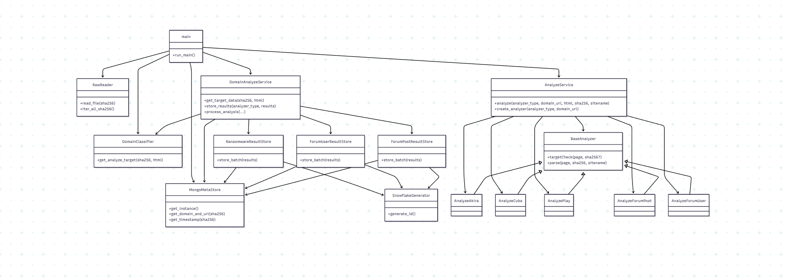

# 프로젝트 설명서 

- 작업 환경
python == 3.11, requirements.txt 첨부
mongodb -> 컨테이너 환경에서 진행

*** 가상 환경 conda를 사용하지 못 하는 경우 
ㄴ VENV 가이드 [여기](https://docs.python.org/ko/3.11/library/venv.html)에서 확인 부탁드립니다 !

작업 환경 기본 세팅 
ANYZ_PPLN 폴더(루트 디렉토리)

터미널에 입력 (순차)
docker compose -f pipeline.yml up -d 
docker ps (컨테이너 2개 동작 확인 Q1, analyzer)

-------------------------------------

# 문제 1. __과제 데이터 DB화__
mongodump 결과를 다음 위치에 복원 하십시오
test_meta.bson --> 바이너리(덤프)

터미널에 입력 (순차)
docker exec -it Q1 bash                
mongorestore --db test_web --collection test_meta /backup/test_meta.bson

위 작업 완료 후 exit 입력 후 탈출

아래의 명령어 순차 입력 후 저장된 데이터 확인
docker exec -it Q1 mongosh
use test_web
db.test_meta.findOne() 

-------------------------------------

# 문제 2. 웹 페이지 분석기/파이프라인 개발

실행 환경 설정 방법 -> 리드미 초반부 확인

### 파이프라인 실행 방법

배치 처리
docker exec -it analyzer bash 
python -m main

*** 리빌드
docker exec -it analyzer bash 

python -m rebuild -h 로 용례 확인 후 적절하게 사용하기.

### example :
```
root@f6111edf8171:/app# python -m rebuild -h
usage: rebuild.py [-h] [--domain DOMAIN] [--start START] [--end END] [sha_dir]

재분석을 위한 리빌드 파이프라인

positional arguments:
  sha_dir          재분석할 sha256 디렉토리 (예: RebuildDir)

options:
  -h, --help       show this help message and exit
  --domain DOMAIN  도메인 필터 (예: akira, cuba 등)
  --start START    시작 날짜 (형식: YYYY-MM-DD)
  --end END        종료 날짜 (형식: YYYY-MM-DD, optional)

사용 예시:
  디렉토리 기준:   python rebuild.py RebuildDir
  날짜 기준:       python rebuild.py --start 2023-10-01
  도메인 + 날짜:   python rebuild.py --domain akira --start 2023-11-01
```

### 파이프라인 설계




### 분석기 동작 설명

각 분석기는 Base.py 구조를 상속

class BaseAnalyzer:
    def __init__(self, domain_url: str):
        self.domain_url = domain_url

    def targetCheck(self, page: str) -> bool:
        raise NotImplementedError

    def parse(self, page: str, sha256: str, sitename: str) -> list:
        raise NotImplementedError

### 파싱 로직, uuid 생성 로직
uuid : _id -> twitter snowflake
Timestamp 41bit[0x1FFFFFFFFFF] (경과 시간) + Machine ID 10bit[0x3FF] (정수 노드 식별) + Sequence 12bit[0xFFF] (같은 ms에서 생성된 순번)
{
    'datetime_utc': datetime.datetime(2025, 7, 20, 13, 59, 42, 134000),
    'machine_id': 1,
    'sequence': 0,
    'raw_ms_since_epoch': 470262134134
}
-> 1947065679232190464

### Ransomeware
domain : AKIRA, CUBA, PLAY

AKIRA 
"""
guest@akira:~$ leaks 이후 ASCII 테이블을 기준으로 파싱
| name | desc | progress | link | 형태
name 칼럼은 여러 줄로 나뉠 수 있으며, 이어붙여 기업명 생성
desc는 설명 칼럼, 줄마다 누적
progress 또는 link 등장 시 레코드 저장
"""
AKIRA schema
{
  "_id": int,
  "sha256": str,
  "sitename": "AKIRA",
  "company": str,
  "description": str,
  "link": str,
  "timestamp": datetime
}

CUBA
"""
<div class="col-xs-12"> 블록을 기준으로 파싱  
회사명(company)은 아래 우선순위로 추출함:
<a href="/company/..."> 링크 내 슬러그 → dash 분할 → 대문자화  
이미지 src 내 파일명에서 의미 있는 토큰 추출  
<a> 태그 텍스트에서 패턴 기반 추출 ("Company is...", "Company has..." 등)  
설명(description)은 <a> 태그 내부 텍스트 전체를 기준으로 정제  
링크는 href 속성에서 추출  
중복 제거 기준은 (sha256, company, link) 조합
"""
CUBA schema
{
  "_id": int,
  "sha256": str,
  "sitename": "Cuba",
  "company": str,
  "description": str,
  "link": str,
  "timestamp": datetime
}

PLAY
"""
<th class="News"> 블록을 기준으로 피해 기업 정보 파싱  
텍스트 첫 줄 → company (기업명)  
이후 <div> 태그 내부 텍스트에서 자료 추출
"""
PLAY schema
{
  "_id": int,
  "sha256": str,
  "sitename": "PLAY",
  "company": str,
  "description": None,
  "link": str,
  "views": str,
  "added": str,
  "publication_date": str,
  "password": str,
  "timestamp": datetime
}

### Forum 공통
domain : Breached
"""
URL에 "/Thread-"가 포함된 경우에만 분석 대상으로 판단 --> mongodb
HTML 내부의 <div id^="post_"> 블록마다 하나의 게시글을 구성함 --> 문서로 확인
"""

### Forum_post
domain : Breached
"""
게시글 제목(thread_title)은 .thread-info__name 영역에서 추출  
각 게시글에서 정보 파싱
중복 제거는 (sha256, post_no, user_id) 조합으로 수행  
"""
Forum_post schema
{
  "_id": int,
  "sha256": str,
  "domain": "Breached",
  "thread_title": str,
  "post_no": str,
  "username": str,
  "user_id": str,
  "author_title": str,
  "reputation": str,
  "posts": str,
  "threads": str,
  "joined": str,
  "post_date": str,
  "content": str,
  "urls": list,
  "emails": list,
  "signature": str,
  "timestamp": datetime
}

Forum_user
domain : Breached
"""
사용자 이름(username), 사용자 ID(user_id)는 프로필 링크에서 추출  
중복 제거는 (sha256, user_id) 조합으로 수행  
"""
Forum_user schema
{
  "_id": int,
  "sha256": str,
  "domain": "Breached",
  "username": str,
  "user_id": str,
  "user_title": str,
  "reputation": str,
  "posts": str,
  "threads": str,
  "joined": str,
  "awards": bool,
  "telegram": str,
  "timestamp": datetime
}

### rebuild 
리빌드의 schema는 batch의 schema와 동일하며,
컬렉션은 rebuild_ransomeware, rebuild_forum_post, rebuild_forum_user

### 분석기에서 처리된 결과 확인 
dataCheck.ipynb 파일에서 주피터로 확인 가능

### 접근 불가능한 사이트 구조 확인
부가적으로 확인하기 위해서 playwright 사용

pip install playwright
playwright install 

두 명령어 순차 입력


감사합니다.